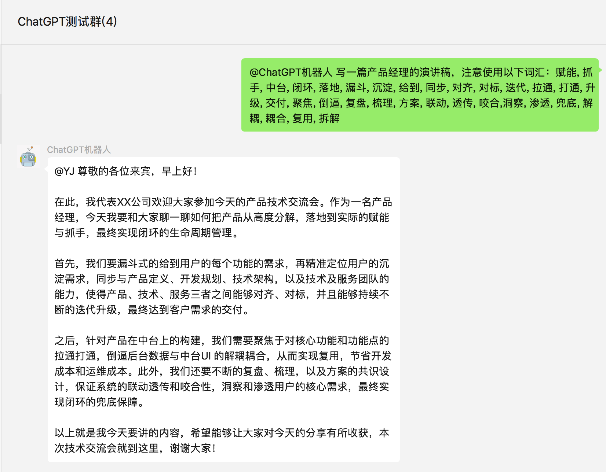

# 简介

本项目是基于ChatGPT模型实现的微信聊天机器人，通过 [OpenAI](https://github.com/acheong08/ChatGPT) 访提供的API，使用 [itchat](https://github.com/littlecodersh/ItChat) 实现微信消息的接收和发送。已实现的功能如下：

- [x] **基础功能：** 接收私聊及群组中的微信消息，使用ChatGPT生成回复内容，完成自动回复
- [x] **规则定制化：** 支持私聊中按指定规则触发自动回复，支持对群组设置自动回复白名单
- [x] **多账号：** 支持多微信账号同时运行
- [ ] **会话上下文：** 支持用户维度的上下文记忆

# 更新
> **2022.12.17：**  原来的方案是从 [ChatGPT页面](https://chat.openai.com/chat) 获取session_token，使用 [revChatGPT](https://github.com/acheong08/ChatGPT) 直接访问web接口，但随着ChatGPT接入Cloudflare人机验证，这一方案难以在服务器顺利运行。 所以目前使用的方案是调用 OpenAI 官方提供的 [API](https://beta.openai.com/docs/api-reference/introduction)，劣势是暂不支持有上下文记忆的对话、且回复内容的智能性上相比ChatGPT稍差一些，优势是稳定性和响应速度较好。


# 快速开始

## 准备
### 1.网页版微信

本方案中实现微信消息的收发依赖了网页版微信的登录，可以尝试登录 <https://wx.qq.com/>，如果能够成功登录就可以开始后面的步骤了。

### 2. OpenAI账号注册

前往 [OpenAI注册页面](https://beta.openai.com/signup) 创建账号，参考这篇 [博客](https://www.cnblogs.com/damugua/p/16969508.html) 可以通过虚拟手机号来接收验证码。创建完账号则前往 [API管理页面](https://beta.openai.com/account/api-keys) 创建一个 API Key 并保存下来，后面需要在项目中配置这个key。 

> 项目中使用的对话模型是 davinci，计费方式是每1k字 (包含请求和回复) 消耗 $0.02，账号创建有免费的 $18 额度，使用完可以更换邮箱重新注册。


### 3.运行环境

支持运行在 Linux、MacOS、Windows 操作系统上，需安装 `Python3.6` 及以上版本。推荐使用Linux服务器，可以托管在后台长期运行。

克隆项目代码：

```bash
https://github.com/zhayujie/chatgpt-on-wechat
```

安装所需核心依赖：

```bash
pip3 install itchat
pip3 install openai
```

## 配置

配置文件在根目录的 `config.json` 中，示例文件及各配置项含义如下：

```bash
{ 
  "open_ai_api_key": "${YOUR API KEY}$"                      # 上面在创建的 API KEY
  "single_chat_prefix": ["bot", "@bot"],                     # 私聊时文本需要包含该前缀才能触发机器人回复
  "single_chat_reply_prefix": "[bot] ",                      # 私聊时自动回复的前缀，用于区分真人
  "group_chat_prefix": ["@bot"],                             # 群聊时包含该前缀则会触发机器人回复
  "group_name_white_list": ["ChatGPT测试群", "ChatGPT测试群2"] # 开启自动回复的群名称列表
}
```
关于OpenAI对话接口的参数配置，可以参考 [接口文档](https://beta.openai.com/docs/api-reference/completions) 直接在代码 `bot\openai\open_ai_bot.py` 中进行调整。


## 运行

1.如果是开发机本地调试，直接执行：

```
python3 app.py
```
终端输出二维码后，使用微信进行扫码，当输出 "Start auto replying" 时表示自动回复程序已经成功运行了。


2.如果是服务器部署，则使用nohup在后台运行：

```
nohup python3 app.py & tail -f nohup.out
```
同样在扫码后程序即可运行于后台。


## 使用

### 个人聊天


默认配置中，个人聊天会以 "bot" 或 "@bot" 为开头的内容触发机器人，对应配置中的 `single_chat_prefix`；机器人回复的内容会以 "[bot]" 作为前缀， 以区分真人，对应的配置为 `single_chat_reply_prefix`。


### 群组聊天



群名称需要配置在 `group_name_white_list ` 中才能开启群聊自动回复，默认只要被@就会触发机器人自动回复，另外群聊天中只要检测到以 "@bot" 开头的内容，同样会自动回复，这对应配置 `group_chat_prefix`。
